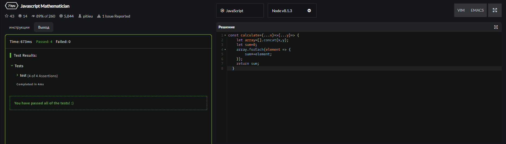
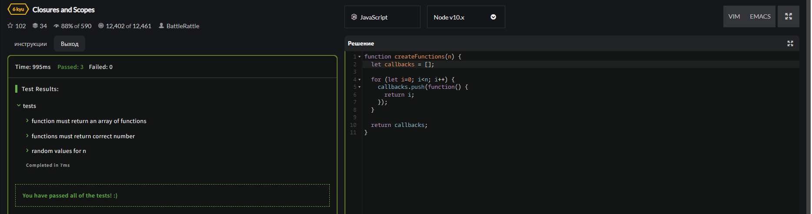
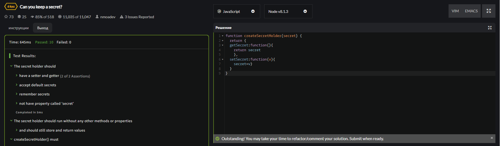
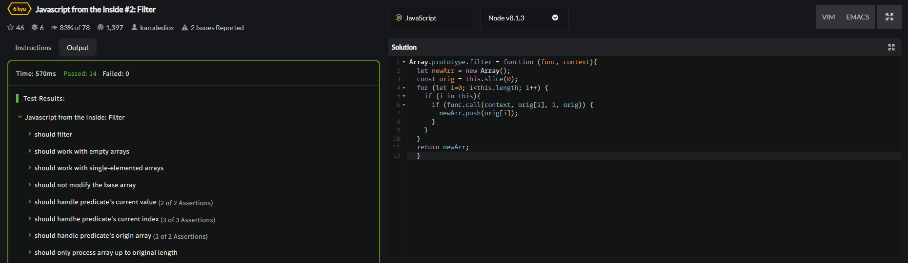
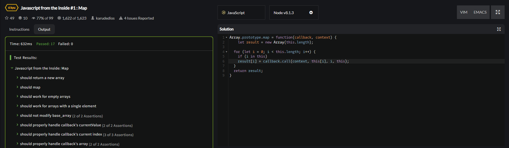

<p align = "center">МИНИСТЕРСТВО НАУКИ И ВЫСШЕГО ОБРАЗОВАНИЯ
РОССИЙСКОЙ ФЕДЕРАЦИИ
ФЕДЕРАЛЬНОЕ ГОСУДАРСТВЕННОЕ БЮДЖЕТНОЕ
ОБРАЗОВАТЕЛЬНОЕ УЧРЕЖДЕНИЕ ВЫСШЕГО ОБРАЗОВАНИЯ
«САХАЛИНСКИЙ ГОСУДАРСТВЕННЫЙ УНИВЕРСИТЕТ»</p>
<br>
<p align = "center">Институт естественных наук и техносферной безопасности</p>
<p align = "center">Кафедра информатики</p>
<p align = "center">Пашаян Самвел Алексанович</p>
<br>
<p align = "center">Лабораторная работа №5</p>
<p align = "center">01.03.02 Прикладная математика и информатика</p>
<br>
<p align = "right" >Научный руководитель</p>
<p align = "right" >Соболев Евгений Игоревич</p>
<p align = "center" >Южно-Сахалинск</p>
<p align = "center" >2022 г.</p>
<p align = "center" ><b>ВВЕДЕНИЕ</b></p>
<p> <b> JavaScript </b> — это язык программирования, который используют для написания frontend- и backend-частей сайтов, а также мобильных приложений. Часто в текстах и обучающих материалах название языка сокращают до JS. Это язык программирования высокого уровня, то есть код на нем понятный и хорошо читается.</p>
<p> JavaScript обычно используется как встраиваемый язык для программного доступа к объектам приложений. Наиболее широкое применение находит в браузерах как язык сценариев для придания интерактивности веб-страницам, для этого даже не требуется компиляция (перевод языка программирования в машинный код). Скрипты можно прописать внутри кода страницы или подключить к HTML отдельным файлом. 
Основные архитектурные черты: динамическая типизация, слабая типизация, автоматическое управление памятью, прототипное программирование, функции как объекты первого класса.</p>
<p align = "center" > РЕШЕНИЕ ЗАДАЧ (ОСНОВНАЯ ЧАСТЬ) </p>

```js 

    function z1(){
        let user = {};
        user.name = "John";
        user.surname="Smith"
        user.name = "Pete";
        delete user.name;
        idfirst.innerHTML="Name-"+user.name+"     Surname-"+user.surname;
    }

    function z2(){
        let schedule = {};
        idfirst.innerHTML= isEmpty(schedule) ; 
        idfirst.innerHTML+="\n";
        schedule["8:30"] = "get up";
        idfirst.innerHTML+=isEmpty(schedule) ; 

    }
    function isEmpty(obj) {
        for (let key in obj) {
        return false;
        }
        return true;
    }

    function z3(){
        const user = {
            name: "John"
        };
        user.name = "Pete";
        idfirst.innerHTML=user.name;
    }

    function z4(){
        let salaries = {
            John: 100,
            Ann: 160,
            Pete: 130
        }
        let sum=0;
        for (let key in salaries) {
            sum+=salaries[key];
        } 
        idfirst.innerHTML=sum;
    }
    function z5(){
        idfirst.innerHTML='';
        let menu = {
            width: 200,
            height: 300,
            title: "My menu"
        };
        
        multiplyNumeric(menu);
        for (let key in menu) {
            idfirst.innerHTML+=menu[key]+"<br>";
        } 
    }
    function multiplyNumeric(obj) {
        for (let key in obj) {
        if (typeof obj[key] == 'number') {
            obj[key] *= 2;
        }
        }
    }

    function z6(){
        let fruits = ["Яблоки", "Груша", "Апельсин"];
        let shoppingCart = fruits;
        shoppingCart.push("Банан");
        idfirst.innerHTML= fruits.length ; 

    }

    function z7(){
        let styles = ["Джаз", "Блюз"];
        styles.push("Рок-н-ролл");
        styles[Math.floor((styles.length - 1) / 2)] = "Классика";
        alert( styles.shift() );
        styles.unshift("Рэп", "Регги");
    }

    function z8(){
        let arr = ["a", "b"];
        arr.push(function() {
        alert( this );
        })
        arr[2](); 
    }

    function z9(){
        idfirst.innerHTML=sumInput();
    }
    function sumInput() {
        let numbers = [];
        while (true) {
        let value = prompt("Введите число", 0);
        if (value === "" || value === null || !isFinite(value)) break;
        numbers.push(+value);
        }
        let sum = 0;
        for (let number of numbers) {
        sum += number;
        }
        return sum;
    }

    function z10(){
        idfirst.innerHTML='';
        idfirst.innerHTML+= getMaxSubSum([-1, 2, 3, -9]); 
        idfirst.innerHTML+="<br>";
        idfirst.innerHTML+=getMaxSubSum([2, -1, 2, 3, -9]); 
        idfirst.innerHTML+="<br>";
        idfirst.innerHTML+=getMaxSubSum([-1, 2, 3, -9, 11]); 
        idfirst.innerHTML+="<br>";
        idfirst.innerHTML+=getMaxSubSum([-2, -1, 1, 2]); 
        idfirst.innerHTML+="<br>";
        idfirst.innerHTML+=getMaxSubSum([100, -9, 2, -3, 5]);
        idfirst.innerHTML+="<br>";
        idfirst.innerHTML+=getMaxSubSum([1, 2, 3]);
        idfirst.innerHTML+="<br>";
        idfirst.innerHTML+=getMaxSubSum([-1, -2, -3]) ;
    }
    function getMaxSubSum(arr) {
        let maxSum = 0; 
        for (let i = 0; i < arr.length; i++) {
        let sumFixedStart = 0;
        for (let j = i; j < arr.length; j++) {
            sumFixedStart += arr[j];
            maxSum = Math.max(maxSum, sumFixedStart);
        }
        }
        return maxSum;
    }

    function z11(){
        let arr = [1, 2, 4, 2, 3, 3, 4, 5, 5, 5, 8, 8, 8, 8, 8, 9, 10];
        arr.sort();
        idfirst.innerHTML=arr;
        for (let i = 0; i < arr.length; i++) {
            if(arr[i+1]==arr[i]){
                if (arr[i+2]==arr[i]) {
                    arr.splice(i+2,1);
                    i--;
                }
            }
            
        }
        idfirst.innerHTML+="<br>"+arr;
    }

    function z12(){
        let array=[0,-5,6,5,-2,-3];
        let sum=0;
        array.forEach(element => {
            if(element<0){
                sum+=element;
            }
        });
        idfirst.innerHTML=sum;
    }

    function z13(){
        let mult=1;
        let array=[0,1,2,3,4,5,6];
        for (let i = 0; i < array.length; i++) {
            if (i%2==1) {
                mult*=array[i];
            }
        }
        idfirst.innerHTML=mult;
    }

    function z14(){
        let sum=0;
        let array=[1,2,0,1,1,1,0,4];
        for (let i = 0; i < array.length; i++) {
            if(array[i]==0){
                i++;
                while(array[i]!=0 ){
                    if(i==array.length-1){
                        sum=0;
                        break;
                    }
                    sum+=array[i];
                    i++
                }
                break;
            }
            
        }
        idfirst.innerHTML=sum;
    }

    function z15(){
        let array=[0,1,2,3,15,4,5,6];
        let max=array[0];
        array.forEach(element => {
            if(element>max){
                max=element;
            }
        });
        idfirst.innerHTML=max;
    }
    
    function z16(){
        let array=[0,1,-2,3,15,4,5,6];
        let min=array[0];
        array.forEach(element => {
            if(element%2==0 &&element<min){
                min=element;
            }
        });
        idfirst.innerHTML=min;
    }

    function z17(){
        let array=[1, 2, 3, 4, 5, 6, 0, 0, 0, 0]
        for (let i = 1; i < array.length; i++) {
            if (array[i]==0 ) {
                let j=i;
                while (j >  0)
                {
                    let temp = array[j - 1];
                    array[j - 1] = array[j];
                    array[j] = temp;
                    j--;
                }
                i--;
            }
        
        }
        idfirst.innerHTML=array;
    }

    function z18(){
        let numbermax=0;
        let numbermin=0;
        let min=0;
        let max=0;
        let arr=[1,2,3,-10,20,2,3,4];
        for (let i = 0; i < arr.length; i++) {
            if(arr[i]>max){
                max=arr[i];
                numbermax=i;
            }
            if(arr[i]<min){
                min=arr[i];
                numbermin=i;
            }
        }
        idfirst.innerHTML=numbermax+numbermin;
    }

    function z19(){
        let array=[2,3,-10,20,2,1,3,4];
        let min=array[0];
        array.forEach(element => {
            if(Math.abs(element)< Math.abs(min)){
                min=element;
            }
        });
        idfirst.innerHTML=min;
    }

    function task20(){
        let array=[];
        for (let i = 0; i < 10; i++) {
            let ran=Math.random();
            if(ran<0.5){
                ran*=-1;
            }
            array.push(Math.floor(ran*10));
        }
        idfirst.innerHTML=array+"<br>";
        let array2=array.splice(0,array.length/2);
        array2.reverse();
        let array3=array.splice(0,array.length);
        array3.reverse();
        array=array2.concat(array3);
        
        idfirst.innerHTML+=array;
    }
    
  

    function z21(){
        let array=[];
        for (let i = 0; i < 12; i++) {
            let ran=Math.random();
            if(ran<0.5){
                ran*=-1;
            }
            array.push(Math.floor(ran*10));
        }
        idfirst.innerHTML=array+"<br>";
        for(let i=0;i<4;i++){
        let temp=array.pop();
        array.unshift(temp);
        }
        idfirst.innerHTML+=array;
    }
```
<p><b>Задачи CodeWars (1)</b></p>

<p><b>Задачи CodeWars (2)</b></p>

<p><b>Задачи CodeWars (3)</b></p>

<p><b>Задачи CodeWars (4)</b></p>

<p><b>Задачи CodeWars (5)</b></p>


<p align = "center" > ВЫВОД </p>
<p> Итогом работы стало создание странички с использованием языка JS. В ходе выполнения задания, мною были решены все выдвинутые задачи, сформулированные исходя из цели лабораторной работы, и в которых нужно было написать функции, выполняющие то или иное действие при помощи различного применения циклов и условий. Это позволяет сделать вывод, что цель данной лабораторной работы успешно достигнута. </p>
